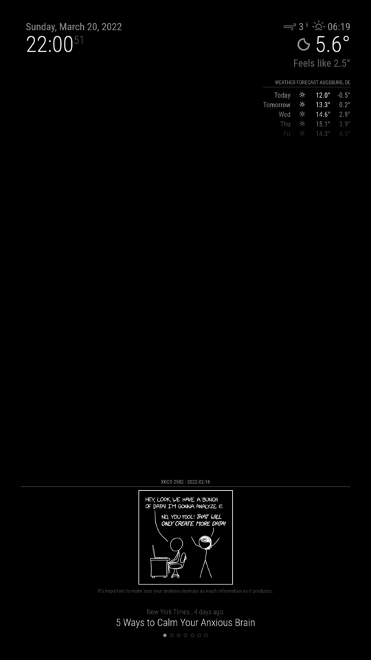

# MMM-Ff-XKCD

[](https://choosealicense.com/licenses/isc)

A module for [MagicMirror²](https://github.com/MichMich/MagicMirror) that displays XKCD comic strips.
I created this version since I wanted to have more control than with the already existing modules [[1]](https://github.com/Blastitt/DailyXKCD) [[2]](https://github.com/jupadin/MMM-XKCD) and have a way to interact with it's content.

Features:

- sequences
- randomness
- events for user interactions
- persistence
- supports multiple module instances
- supports multiple mirror instances, controlled by a single server

## Installation

Just navigate to the `modules` directory of your MagicMirror² installation and clone this repository.

```sh
git clone https://github.com/shin10/MMM-Ff-XKCD.git
```

## Configuration

**Example:**

```js
{
  module: "MMM-Ff-XKCD",
  position: "bottom",
  hiddenOnStartup: true,
  config: {
    header: "xkcd",
    updateInterval: 1 * 60 * 1000,
    grayscale: false,
    inverted: true,
    imageMaxWidth: null,
    imageMaxHeight: null,
    showTitle: true,
    showDate: true,
    showAltText: true,
    showNum: true,
    initialComic: "random",
    sequence: "default",
    updateOnSuspension: true,
    events: {
      COMIC_FIRST: "ARTICLE_FIRST",
      COMIC_LATEST: "ARTICLE_LATEST",
      COMIC_PREVIOUS: "ARTICLE_PREVIOUS",
      COMIC_NEXT: "ARTICLE_NEXT",
      COMIC_RANDOM: "ARTICLE_RANDOM"
    }
  }
}
```

### Configuration Options

| **Option**           | **Type**         | **Default**        | **Description**                                                                                                  |
| -------------------- | ---------------- | ------------------ | ---------------------------------------------------------------------------------------------------------------- |
| `header`             | `string`         | `"xkcd"`           | The header text.                                                                                                 |
| `initialComic`       | `string`         | `"latest"`         | Sets the comic on startup to be the `"first"`, `"latest"`, `"random"`, or a specific one by _id_ (`int`).        |
| `sequence`           | `string`         | `"random"`         | The direction to loop through the comic strips. `null`/`"default"`, `"reverse"`, `"random"`.                     |
| `updateInterval`     | `int`            | `3600000` (1 hour) | The duration of the update interval in ms or `null`.                                                             |
| `updateOnSuspension` | `bool`           | `null`             | When to update the image. `null`, `false` or `true`. Further explanations below.                                 |
| `grayscale`          | `bool`           | `false`            | Reduce the colors to shades of gray.                                                                             |
| `inverted`           | `bool`           | `true`             | Invert the colors of the comic strip.                                                                            |
| `imageMaxWidth`      | `string`         | `null`             | Maximum _width_ of the comic strip in any valid _css unit_ like `px`, `%`, `vw`, `vmin` ...                      |
| `imageMaxHeight`     | `string`         | `null`             | Maximum _height_ of the comic strip in any valid _css unit_ like `px`, `%`, `vh`, `vmin` ...                     |
| `showTitle`          | `string`         | `true`             | Show/hide the _title_ of the current comic strip.                                                                |
| `showDate`           | `string`         | `true`             | Show/hide the _date_ of the current comic strip.                                                                 |
| `showAltText`        | `string`         | `true`             | Show/hide the _alt_-text of the current comic strip.                                                             |
| `showNum`            | `string`         | `true`             | Show/hide the _id_ of the current comic strip.                                                                   |
| `animationSpeed`     | `string`         | `1000`             | The duration of the page transition.                                                                             |
| `events`             | `object`         |                    | A filter and list of _event constants_ to remap if necessary.                                                    |
| `events.sender`      | `string`/`array` | `undefined`        | Filter events to those dispatched by given _module ids_.                                                         |
| `persistence`        | `string`         | null               | Save current position in sequence. `null`, `"electron"`, `"client"`, `"server"`. See further explanations below. |
| `persistenceId`      | `string`         | null               |                                                                                                                  |
| `persistencePath`    | `string`         | null               | The directory used for persistent data on the servers file system. Will fall back to `"$MODULE_PATH/.store"`     |

### `updateInterval` and `updateOnSuspension`

These two parameters work together. The `updateInterval` is used to set the **_minimal_** amount of time the displayed item has to exist, before it will be replaced by the next. When this actually will take place depends on the value of `updateOnSuspension`.

If `updateOnSuspension` is set to `true` the item will wait till the interval timer fired and the module goes to the background. If set to `false` the `updateInterval` has to elapse while the item is in background and will replace the item when the module is shown again.

If `updateOnSuspension` is set to `null` the content will be replaced whenever the timer is done; visible or not.

If `updateInterval` is set to `null` the item won't be updated by the module. Instead you'll have to dispatch one of the events listed above.

### Events

The following events are supported:

- COMIC_FIRST
- COMIC_LATEST
- COMIC_PREVIOUS
- COMIC_NEXT
- COMIC_RANDOM

For ease of use they can be remapped in the `events` object to custom strings. Refer to the example config above.

Events will be ignored if the module is currently hidden.

### Persistence

If the mirror will shut down regularly it might be desireable to save the current position in your sequence. Depending on your scenario and hardware setup the best place to save the data will be either on client or server-side.

If you have only one client it's probably the best idea to set `persistence` to `"electron"`.
`"client"` will save the data to any browsers instance _localStorage_. A good default if you have only one MM² screen.
`"electron"` will save the data to the electron client's _localStorage_ but not to other browser instances. This comes in handy if you open the mirror parallel on another machine for development and want to avoid unexpected behaviour.
`"server"` will save the data to your servers file system. This might be the best option if you're running multiple screens for one server instance. File system access however is dangerous if you don't know what you're doing. Use at own risk!

`"persistenceId"`: The _localStorage key_ or _fs filename_ to save the data to. It defaults to the _module identifier_ provided by MM² automatically to support multiple instances. It's perfectly fine to leave it that way, but if you're currently experimenting with the config and module instances are changing their position within the modules array of the `config.js` file, it might be better to set this manually.
`"persistencePath"` `"./modules/MMM-Ff-XKCD/.store"` only used by `fs`. It might be important to customize this to a mounted directory if you are running MM² in a containerized environment like docker.
